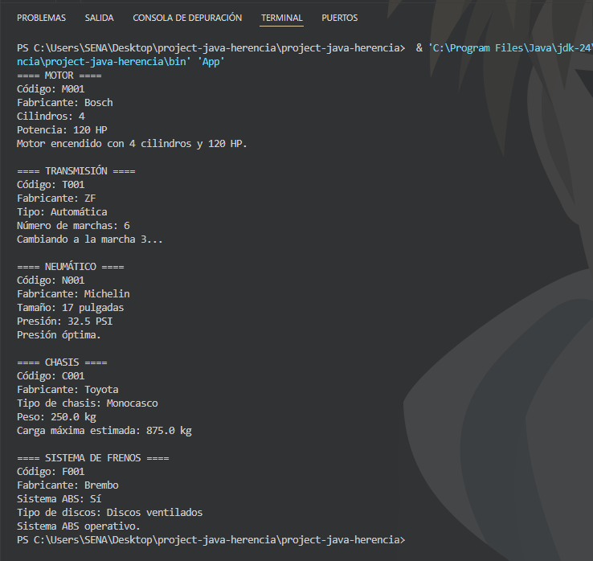

# 🚗 Proyecto: Componentes Vehiculares – Herencia en Java

Este proyecto demuestra el uso del **principio de herencia** en Java a través de una jerarquía de clases relacionadas con componentes vehiculares. Cada clase especializada hereda de una clase base (`ComponenteVehicular`) y añade comportamientos particulares.

## 🧩 Jerarquía de Clases

```
ComponenteVehicular
│
├── Motor             -> encenderMotor()
├── Transmision       -> cambiarMarcha(int)
├── Neumatico         -> verificarPresion()
├── Chasis            -> calcularCargaMaxima()
└── SistemaFrenos     -> verificarABS()
```

## 📂 Estructura del Proyecto

- `ComponenteVehicular.java`: Clase base con atributos comunes (`codigo`, `fabricante`) y método `mostrarInformacion()`.
- `Motor.java`: Hereda de la clase base, agrega atributos `cilindros` y `potencia`, y el método `encenderMotor()`.
- `Transmision.java`: Añade atributos `tipo` y `marchas`, y el método `cambiarMarcha(int)`.
- `Neumatico.java`: Incorpora `tamaño` y `presion`, e implementa `verificarPresion()`.
- `Chasis.java`: Tiene `tipo` y `peso`, con un método para `calcularCargaMaxima()`.
- `SistemaFrenos.java`: Integra `tieneABS` y `tipoDiscos`, con la función `verificarABS()`.
- `Main.java`: Clase principal que instancia cada componente y ejecuta sus métodos para mostrar su información y comportamiento.

## ✅ Comportamientos Especializados

| Clase           | Método particular         | Funcionalidad                                                    |
|----------------|---------------------------|------------------------------------------------------------------|
| `Motor`        | `encenderMotor()`         | Imprime mensaje de encendido con potencia y cilindros           |
| `Transmision`  | `cambiarMarcha(int)`      | Cambia la marcha validando el rango disponible                  |
| `Neumatico`    | `verificarPresion()`      | Verifica si la presión está dentro del rango recomendado        |
| `Chasis`       | `calcularCargaMaxima()`   | Calcula carga máxima estimada según peso del chasis             |
| `SistemaFrenos`| `verificarABS()`          | Informa si el sistema ABS está operativo                        |

## 💻 Captura de salida por consola




## 🛠️ Tecnologías

- Lenguaje: Java
- Entorno: Cualquier IDE compatible con Java (Eclipse, IntelliJ, VS Code)

## 📌 Objetivo Educativo

Aplicar los conceptos de **herencia**, **sobrescritura de métodos (`@Override`)**, y la **modularización de clases**, representando componentes reales de un vehículo.
